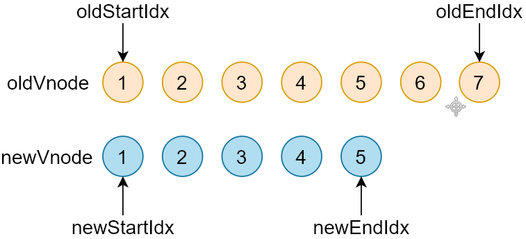
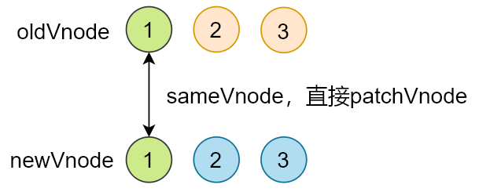
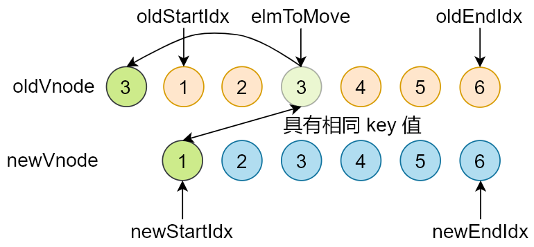

#### React 与 Vue 的差异

- 相同点：
  - 都采用Vdom
  - 都是响应式
  - 都使用组件化思想
  - 都可以服务端渲染

- 概念(设计核心思想)上来说： React是构建用户界面的js库，设计理念是all in Js，推崇**函数式编程(纯组件)，数据不可变以及单向数据流**，Vue 是前端页面应用的渐进式框架，推崇**易用，数据可变，双向数据绑定(依赖收集)**
- 写法上的差异： Vue建议采用template，虽然后续也支持了jsx，但是官方首推的还是template，基于此，他们之间的api也不相同，vue的**template + options api**(vue3 setup composition)的写法需要理解掌握较多的概念和api，如slot filter指令等，而React只需要简单的hook
- 从组件实现上也不同： vue把options挂载到Vue核心类上，然后new Vue({options})拿到实例(vue 组件导出的是options的纯对象)，react通过render(类)或通过return jsx直接生成Vnode(掌握更新两者渲染机制)
- **响应式原理**:
  - vue依赖收集，自动优化，递归监听data的所有属性并修改，当数据改变时自动找到引用组件重新渲染(proxy)
  - react基于状态机，更新组件的state，然后根据新的state重新渲染界面
- **diff算法**：
  - 基本思路是一致的：不同组件产生不同的DOM结构，当type不同时，销毁老的DOM，构建新的DOM；同一层次子节点通过key区分
  - 源码实现上却有差别：vue基于snabbdom，Vue diff使用双向链表，边对比，变更新，3又提出了动静结合的Dom，减少不必要的patch；React采用diff queue保存需要更新的DOM，得到patch树，再统一操作批量更新
- **事件机制不同**：Vue原生事件采用标准web事件，Vue自定义的事件机制是父子通信的基础；而React原生事件被包装，所有事件都冒泡到顶层根节点监听，然后再合成下发，父子组建通信通过props

React更关注于底层的实现，上层应用解决方案基本不插手，Vue定位于快速解决问题，所以很多应用解决方案都是官方主导开发维护


### patchVnode

- **功能：**

  - patchVnode(oldVnode, vnode, insertedVnodeQueue)
  - 对比 oldVnode 和 vnode 的差异，把差异渲染到 DOM 

- **执行过程：**

  - 首先执行**用户**设置的 **prepatch** **钩子**函数
  - 执行 create 钩子函数
    - 首先执行**模块**的 **create** **钩子**函数
    - 然后执行**用户**设置的 **create** **钩子**函数
  - 如果 **vnode.text** 未定义
    - 如果 `oldVnode.children` 和 `vnode.children` 都有值
      - 调用 `updateChildren()`
      - 使用 diff 算法对比子节点，更新子节点
    - 如果 `vnode.children` 有值，`oldVnode.children` 无值
      - 清空 DOM 元素
      - 调用 `addVnodes()`，批量添加子节点
    - 如果 `oldVnode.children` 有值，`vnode.children` 无值
      - 调用 `removeVnodes()`，批量移除子节点
    - 如果 **oldVnode.text** 有值
      - 清空 DOM 元素的内容
  - 如果设置了 `vnode.text` 并且和和 `oldVnode.text` 不等
    - 如果老节点有子节点，全部移除
    - 设置 DOM 元素的 `textContent` 为 `vnode.text`
  - 最后执行用户**设置的** **postpatch** **钩子**函数

### updateChildren

- **功能：**

  - diff 算法的核心，对比新旧节点的 children，更新 DOM
  - 在进行同级别节点比较的时候，首先会对新老节点数组的开始和结尾节点设置标记索引，遍历的过程中移动索引
  - 在对**开始和结束节点**比较的时候，总共有四种情况
    - oldStartVnode / newStartVnode (旧开始节点 / 新开始节点)
    - oldEndVnode / newEndVnode (旧结束节点 / 新结束节点)
    - oldStartVnode / oldEndVnode (旧开始节点 / 新结束节点)
    - oldEndVnode / newStartVnode (旧结束节点 / 新开始节点)

  

  - 开始节点和结束节点比较，这两种情况类似
    - oldStartVnode / newStartVnode (旧开始节点 / 新开始节点)
    - oldEndVnode / newEndVnode (旧结束节点 / 新结束节点)
  - 如果 oldStartVnode 和 newStartVnode 是 sameVnode (key 和 sel 相同)
    - 调用 patchVnode() 对比和更新节点
    - 把旧开始和新开始索引往后移动  oldStartIdx++ / oldEndIdx++

  

   - oldStartVnode / newEndVnode (旧开始节点 / 新结束节点) 相同
     - 调用 patchVnode() 对比和更新节点
     - 把 oldStartVnode 对应的 DOM 元素，移动到右边
       	- 更新索引

  

  - oldEndVnode / newStartVnode (旧结束节点 / 新开始节点) 相同
    - 调用 patchVnode() 对比和更新节点
     - 把 oldEndVnode 对应的 DOM 元素，移动到左边
     - 更新索引

  

  - 如果不是以上四种情况
    - 遍历新节点，使用 newStartNode 的 key 在老节点数组中找相同节点
    - 如果没有找到，说明 newStartNode 是新节点
      - 创建新节点对应的 DOM 元素，插入到 DOM 树中
    - 如果找到了
      - 判断新节点和找到的老节点的 sel 选择器是否相同
      - 如果不相同，说明节点被修改了
        - 重新创建对应的 DOM 元素，插入到 DOM 树中
      - 如果相同，把 elmToMove 对应的 DOM 元素，移动到左边

  

  - 循环结束
    - 当老节点的所有子节点先遍历完 (oldStartIdx > oldEndIdx)，循环结束
    - 新节点的所有子节点先遍历完 (newStartIdx > newEndIdx)，循环结束
  - 如果老节点的数组先遍历完(oldStartIdx > oldEndIdx)，说明新节点有剩余，把剩余节点批量插入到右边

  

  ​	

    - 如果新节点的数组先遍历完(newStartIdx > newEndIdx)，说明老节点有剩余，把剩余节点批量删除

  

### 响应式基本原理

- 本质是在创建vm实例时，对传入的数据进行get set处理以及相关依赖数据变动时更新视图、视图更新时数据更新，主要有几个重点：
  - 创建实例时，挂载options、el、data...到vm的实例上，对挂载的数据进行劫持(设置get set)，同时也要考虑data中有数据还是引用类型的数据，递归处理
  - data要变成响应式数据，则在取值时(get)就要添加一个数据依赖(即把数据变更时的回调函数保存起来)，在修改值时(set)发送通知(即执行保存的回调函数，这个函数其本质就是修改dom中展示此变更数据部分)
  - 这个依赖和回调函数什么时候添加？则就要在展示数据dom部分首次渲染后就要添加视图与数据的联系，即让数据与视图有了联系的桥梁
  - 后续更改数据，则就会走到set这部分就触发回调修改视图
  - 视图数据更改到vm数据更改则是在视图部分添加一个事件input 监听函数，在回调执行更改数据的操作

- V2： 通过 Object.defineProperty来设置 get set数据劫持， get获取data中某个值，如果data改变则在set内更改dom
- V3： 通过 new Proxy代理整个data进行处理

- 发布订阅模式
  - 通过事件触发器$on注册事件，$emit调用事件，
  - 事件注册或调用不依赖
- 观察者模式
  - 观察者Watcher创建update函数更新
  - 发布者Dep添加订阅(addSub)并发布通知(notify ,即调用update)
  - 发布订阅相互依赖

### Diff 算法的执行过程

- Diff首先是同级比较，比较新旧Vnode的差异，从而确定是否更新或复用Dom；
- 对新旧Vnode节点的开始和结束位置进行标记：oldStartIndex、oblEndIndex、newStartIndex、newEndIndex
- 对同级的所有子node进行遍历比较，while，当oldStartIndex > oblEndIndex || newStartIndex > newEndIndex退出循环，在此条件下又分为以下几种情况：
  - oldStartINdex对应的oldVnode 与newStartIndex Node满足sameVnode(可以复用的节点)，直接patchNode(节点复用处理)，并新老节点的索引+1
  - 否则，比较sameVonde(oldEndNode, newEndNode)，直接patchNode，索引-1
  - 再比较oldStartVnode与newEndVnode，若满足sameVnode条件，则patchNOde，且移动旧的真实Dom到末尾，旧索引+1，新-1
  - sameVonde（oldEndVnode与newStartVnode）若满足，patchNode后移动旧的真实DOM到开始位置，旧索引 -1，新索引 +1
  - 如果以上四种都不满足，则通过旧Vnode index与key 关系找到与当前新的StartVnode索引key对应的旧节点，比较sameVnode，若满足，则patchNode，然后再把旧节点移动到OldStartVnode前面，若不满足，则createElem新建一个元素放到新startIndex位置

- while循环完成之后，根据新老节点的数据不同再做相应的调整，如果老节点数目大于新节点的个数，则把未匹配的节点删除，若旧节点个数小于新节点，则要把新节点剩余的节点创建对应的元素添加到真实Dom中
- Vue初始化

  - 给Vue实例添加一些方法和属性
    - initMixin：给Vue原型增加 _init
    - stateMixin: 给 Vue prototype 增加全局方法和属性比如：$delete $set $watch $props $data
    - eventsMixin: 原型 + $emit $off $once 等
    - lifecycleMixin: 原型 + $forceUpdate $destory _update
    - renderMixin: + _render nextTick等

  - 初始化挂载全局的组件指令方法等，initGobalAPI（Vue），component directive filter mixin obeservable  extend options(components(KeepAlive) directives filters)
  - 设置Vue.config 参数随后并在Vue原型 + $mount（把页面挂载到浏览器）
  - 在runtime + compiler版本重写mount
    - 查询 el，判断el不能是body或document元素
    - options 没有render则判断template，有template 则获取对应的template innerHtml(‘#string’等形式)，没有template则获取el的外部元素为模板
    - 编译获取的template(compileTofunctions)得到render函数给options
- Vue初始渲染

  - 初始化Vue，添加实例成员静态成员等

  - new Vue, 调用_init 初始化vue实例，合并options

  - 设置实例的renderProxy，并给实例挂载一些成员

  - 调用.$mount

    - 如果是runtime+complier版本则调用上述带编译版本的mount，runtime则在mount中重新获取el

  - 随后后调用了mountComponent函数

    - 判断是否有render

    - 触发beforeMount 

    - 定义updateComponent更新组件

      - 调用render生成虚拟Dom
        - 调用用户传入的render
        - 或compileTofunctions生成的render
        - return Vnode

      - 返回的虚拟DOM传入vm._update，将虚拟DOM挂载到真实页面, 其实就是执行_patch(vm.$el, Vnode)

  - 实例化Watcher
    - 在Watcher里面传入了上述的updateComponent函数，并根据是否及时更新(y)通过get来调用updateComonent
    - updateComponent中先调用_render() 产生虚拟DOM，无论是用户传入的render还是模板编译的render，内部的h函数其本质还是createElement()
    - 后再调用_update(vnode)把虚拟dom转成真实dom，这里又执行了 _ _patch_ _(preVode, vode)函数，此函数在内部定义了操作dom的api，最后返回patch函数，在patch函数内会挂载节点属性事件等操作回调，patch：
      - 判断第一个参数是真实DOM还是虚拟DOM，首次加载时，第一个参数是真实dom，会转换成虚拟dom调用createElm(createElm把vnode及vnode 的children转成真实dom挂载到)真实dom
      - 若是数据更新，则判断sameVnode后patchVnode(diff)
        1. patchNode对比新旧vnode及其子节点，并更新差异，如果新旧vnode都有子节点且子节点不同就用updateChildren对比差异
        2. updateChildren，参考 Diff 算法的执行过程

  - 触发mounted钩子，返回实例
- Vue 中数据响应式的处理

  - 初始化Vue时，进行initState、initData、oberve()
  - observe(value)，判断value是否是对象，是对象再判断对象是否具有__ob__属性，有直接返回，没有则调用Observe，新建一个observe对象并返回
  - new Observe(), 给value对象定义不可枚举的ob属性并记录此observe对象，
    - 是数组对象，则重写数组的push pop shift unshift splice sort reverse 方法(数组改变发送通知dep.notify)，遍历数组中每个值进行observe()
    - 不是数组对象，调用walk(value),遍历每个key，对值进行defineRactive

  - defineReactive, 为每个属性创建Dep对象，如果是对象再对其进行observe
    - getter，收集依赖，如果有子对象也对子对象收集依赖
    - setter， 保存新值，新值是对象也调用observe，发送通知dep.,notify

  - 收集依赖，在实例化Watche调用get方法()r时，把watcher保存到Dep.target中；访问data属性在defineReactive时，把watcher对象添加到dep.subs数组中(dep.depende())，如果有子对象，对子对象也添加依赖
  - Watcher， 数据变化发送通知其实调用的是watcher对象的update方法
    - queueWatcher判断watcher是否被处理，没有处理添加到队列中，随后flushSchedulerQueue
    - flushSchedulerQueue，触发beforeUpdate，调用watcher.run()(其实也是调用watcher.get()),清空上一次依赖，触发actived钩子，updated
- 模板编译过程
  - 看缓存是否有当前模板编译好的render函数
  - 没有则编译模板complie(template, options),合并当前组件options和Vue的options
  - 在baseComplie中把模板转成AST语法树，并对AST语法树进行优化，找出静态节点以及根节点(包含静态文本且有其他标签)，静态节点patch会跳过，再通过generate 把优化后的ast转成字符串形式的js代吗
  - 最后，调用createFunction把js代吗转成js函数，产生render和staticRenderFns，并挂载到options上


#### Vue 3.0 性能提升主要是通过哪几方面体现的？

 - 源码打包体积的优化
   - 3.0中使用tree sharking 技术，在编译阶段通过静态分析，找到未引入的vue模块进行标记，这些未引入的模块的代码就不会打包从而减少项目中vue包的体积
   - 同时3.0也移除了一些冷门的模块，比如filter inline-template等
 - 数据劫持的优化
   - 3.0用Proxy代替Object.defineProperty 来处理响应式数据，defineProperty是对数据属性进行劫持，增加getter或setter，形如defineProperty(targert, key, handler = {getter ..., setter}),因为是对单个属性的劫持，所以无法处理数据增加或删除或数组索引长度变化时的响应变化，而且对数据嵌套层级比较深时，需要一直递归处理；
   - 而Proxy则是对整个target进行劫持，所以数据增加或删除时能实时触发trigger函数，且是在内部数据访问到的时候才会变成响应式
 - 编译上的优化
   - 3.0对应的vite更好的开发体验
   - Vnode节点更新的优化，节点重新渲染跟动态内容有关，而不是2.0那样跟模块大小有关(组件有很多静态节点，但只有一个动态节点，但是动态节点改变也会遍历同级的vnode消耗性能)

#### Vue 3.0 所采用的 Composition Api 与 Vue 2.x使用的Options Api 有什么区别？

   Options Api包含所有描述组件信息选项的对象，如果实现一个功能，可能会分别在data methods或computed等地方进行不同的数据处理和事件函数，Composition则提供一个函数，在这个函数内部可以设计组件需要的响应数据和方法，把同一个功能代码组和在一起更有利于阅读和维护

#### Proxy 相对于 Object.defineProperty 有哪些优点？

 - Proxy可以监听到数组的变化，而defineProperty不能监听，vue是改造了数组的shift pop等八中方法
 - defineProperty只能劫持对象属性的变化，对整个数据劫持需要遍历每个属性，如果属性值是对象还需要进一步遍历，如果嵌套层级比较深则比较消耗性能，而proxy可以劫持整个对象返回新的proxy对象，而且proxy内部handler 除了get set deleteProperty等拦截方法还有其他函数方法，


#### Vue 3.0 在编译方面有哪些优化？

- 2.0中模板被编译成渲染函数，当组件的状态发生变化通知watcher，触发watcher的update最终去执行vnode的patch操作，为每个vnode找到差异并更新到真实DOM， 所以V2的更新是组件级的。在diff中，通过标记静态根节点优化diff过程，但每次也都要比较剩下的所有新旧节点，
- 3.0增加了Fragment并会提升标记静态根节点(提升到render外部初始化的时候只创建一次)，diff只对比动态更新的内容(设置patchFlag，根据flg不同标记相应的什么内容变化从而对对应的内容diff，从而提交diff的性能)，所以v3的更新针对动态内容，v3增加了cache缓存事件等，首次渲染后把绑定的事件缓存成一个函数，随后渲染会直接使用缓存的函数得到，从而减少不必要的更新

　

#### Vue.js 3.0 响应式系统的实现原理？

 - 用weakMap的数据形式存储数据(target)的所有依赖关系(value),value中是target的每个属性对应的所有的effect的Map数据，其中effect是用Set数据存放，避免有重复的effect触发

- 用Proxy代理数据，添加get、set 、deleteProperty 处理函数，在获取目标对象数据时，触发get，在get中添加一个track，来跟踪数据变化，track实现的核心是收集到数据属性的相关依赖，通过在暴露给外部一个接口(effect)传入依赖回调并立即执行这个回调来触发proxy数据的get，在track内进行收集；同时在set或deleteProperty中添加trigger，当在外部对响应式数据进行重新赋值或改动时则会调用trigger，同时依次遍历所有的effect Set集合进行重新计算，实现数据响应同步

#### vite创建一个项目后注意点

- ```node
  npm init vite@latest
  ```

- ```node
  // 为项目添加相应的eslint规则配置，安装相应的eslint插件
  // 其中一些特殊的eslint配置可查看eslint相关的插件，比如：eslint-plugin-vue等
  npm install eslint --save-dev
  npx eslint --init
  // 为git commit 添加eslint检查避免错误格式的代码提交到仓库
  // 通过husky提供git hook，进行检查
  // husky 安装后要执行husky install
  npx mrm@2 lint-staged
  // 在代码开发阶段，出现lint出错误时报错提示
  npm install vite-plugin-eslint // 随后在vite.connfig.js中注入插件
  // 为项目添加 commit message 语法验证
  npm install --save-dev @commitlint/{config-conventional,cli}
  echo "module.exports = {extends: ['@commitlint/config-conventional']}" > commitlint.config.js
  npx husky add .husky/commit-msg 'npx --no -- commitlint --edit "$1"'
  
  ```